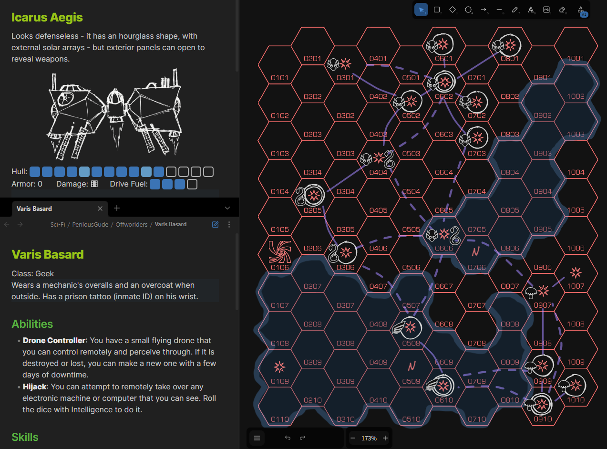
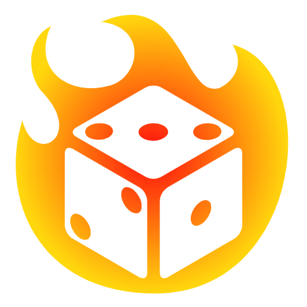

# Description
This is a sample of my personal Obsidian vault I use to play RPGs, mostly solo. It contains adventure journals, character sheets and some maps and illustrations. Most of the content is written in English, but some of it is in Portuguese. Feel free to use this for inspiration for your own games, or even as a template if you wish. You will need the Obsidian app to view it properly.

*Sample usage of this vault displaying three notes: one with a spacecraft, another with a character description, and the third one with the hex grid map of a space sector.*

# Sources

## Icons

I use the iconize Obsidian plugin with the two predefined packs `lucide-icons` and `rpg-awesome`. I also use a custom icon pack with the free icons available in https://game-icons.net/.

## RPG Systems & Supplements
The RPG systems I used in this vault include:
 - [Savage Worlds Adventure Edition](https://www.drivethrurpg.com/en/product/261539/savage-worlds-adventure-edition) (SWADE) - Setting-agnostic system
  - [Ironsworn](https://www.drivethrurpg.com/en/product/238369/ironsworn) - Low fantasy solo RPG. `Free!`
  - [Offworlders](https://www.drivethrurpg.com/en/product/257632/offworlders) - Rules-light space opera `Free!`
  - [FIST: Ultra Edition](https://www.drivethrurpg.com/en/product/306921/fist-ultra-edition) - Paranormal mercenaries.

And the supplements:
 - [The Perilous Void](https://www.drivethrurpg.com/en/product/502848/the-perilous-void)
 - [Sprawlrunners](https://www.drivethrurpg.com/en/product/334278/sprawlrunners) - Supplement for SWADE
 - [The Book of Random Tables: Cyberpunk](https://www.drivethrurpg.com/en/product/307740/the-book-of-random-tables-cyberpunk)
 - [Augmented Reality](https://www.drivethrurpg.com/en/product/202175/augmented-reality-the-holistic-city-kit-for-cyberpunk-games) - The Holistic City Kit For Cyberpunk Games `Free!`
